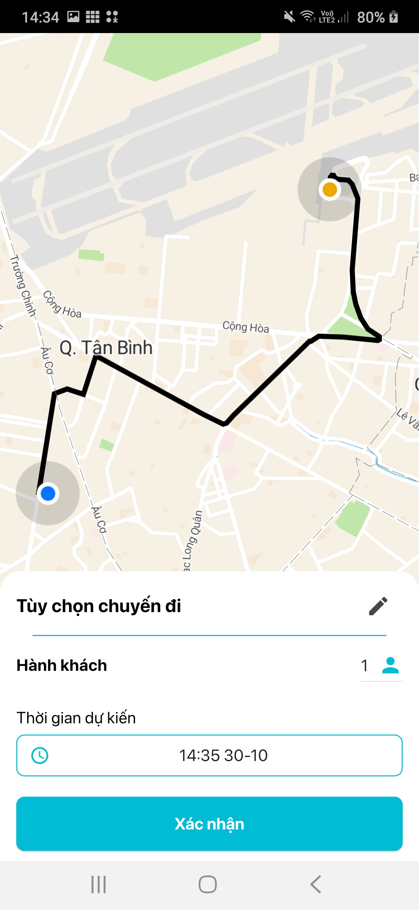

# Airport Booking Car App - Client Side

A customer-facing airport ride booking application developed using Flutter.

## Introduction

This Flutter app lets customers book airport rides easily and quickly.

## Technologies Used

- **Flutter**: Main framework for cross-platform UI..
- **GetX**: Manages state, navigation, and dependencies.
- **Firebase**: Enables real-time push notifications.
- **Pusher**:  Provides real-time driver tracking.

## Screenshots

### Home Screen

### Booking Details Screen

  
  
  
  

### Real-Time Driver Tracking

### Activities

